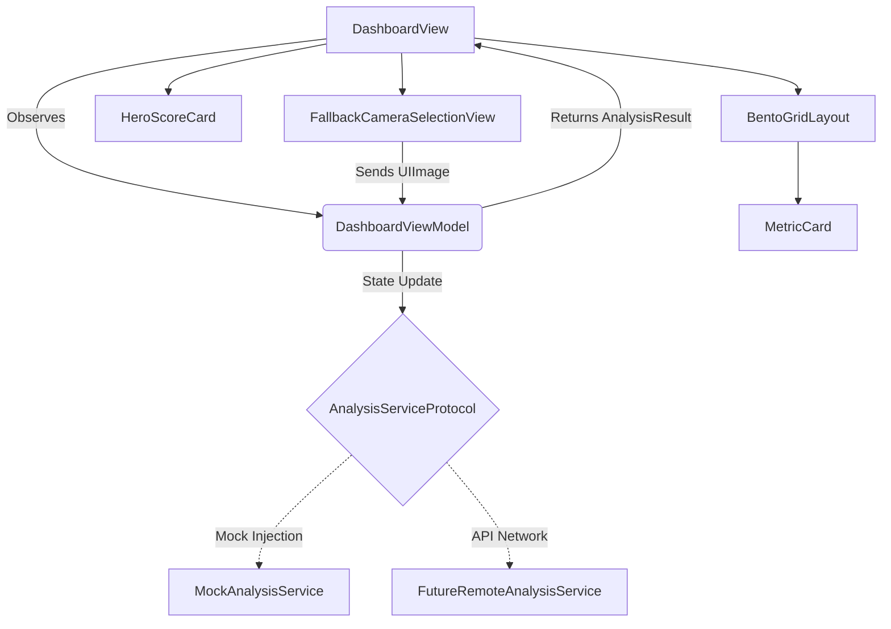

# Aura: Luxury Facial Analytics Platform

## 1. Product Requirements Document (PRD)

### Executive Summary
Aura is an elite biometric assessment platform that maps facial structure to the universally recognized PSL aesthetics scale. Aura provides precision insights devoid of gamification. It targets individuals who treat their physical appearance structurally and scientifically. 

### Core Features
- **Precision Image Ingestion:** Fallback camera/photo library selection flow.
- **Biometric Processing:** Maps images using facial landmark algorithms (Mock/OpenCV/MediaPipe).
- **Flagship Dashboard:** A Bento-Grid UI detailing Eye Area, Jawline, Dimorphism, Symmetry, and Dermal quality.
- **PSL Scoring Framework:** Accurate 1.0 to 10.0 spectrum logic (Sub-3 through True Adam/8.5+).
- **Accessibility Integration:** Dynamic Type compliance, VoiceOver support on every card, high contrast elements, and Reduced Motion support for bouncing animations.

---

## 2. Accessibility Compliance
Aura conforms to strict iOS accessibility guidelines to ensure usability without compromising the clinical aesthetic:
- **Dynamic Type:** All SF Pro typography uses relative text scaling (`.font(.system(.title3))`, `.subheadline`, etc.) rather than hardcoded pixel heights where possible. 
- **VoiceOver:** Every metric card (`MetricCard`, `HeroScoreCard`) has dedicated, concise `.accessibilityLabel()` traits.
- **Reduced Motion:** Dashboard state transitions respond to `@Environment(\.accessibilityReduceMotion)` to swap spring scales with basic opacity changes.
- **High Contrast:** The color palette (e.g. `#8B5CF6`, `#FFFFFF` against `#0D0D12`) passes WCAG AA contrast standards.

---

## 3. Future AI Roadmap
- **Phase 1: Mock/Device ML** (Current): On-device mock simulator for rapid UI iterations.
- **Phase 2: Vision Framework & MediaPipe Mesh**: Integrate `VNDetectFaceLandmarksRequest` for localized mesh generation.
- **Phase 3: OpenCV & Custom Model Backends**: Swap `MockAnalysisService` with `FutureRemoteAnalysisService` to POST images to a Python backend.
- **Phase 4: Progression & GPT Insights**: Store historical `AnalysisSession` records. Run GPT analyses on trajectory changes over time. Provide premium subscription gating for deep historical trend visualizations.

---

## 4. Architecture Diagram (Mermaid)



---

## 5. Directory Structure
```
Aura-iOS/
├── Models/
│   ├── DataModels.swift
│   └── MockData.swift
├── Services/
│   └── AnalysisService.swift
├── ViewModels/
│   └── DashboardViewModel.swift
├── Components/
│   ├── DesignSystem.swift
│   ├── HeroScoreCard.swift
│   ├── MetricCard.swift
│   └── BentoGridLayout.swift
├── Views/
│   ├── DashboardView.swift
│   └── FallbackCameraSelectionView.swift
└── PRD_And_Architecture.md
```
